# 起步走 {#gettingStarted}

> The way R works is pretty straightforward, you apply functions to objects.
> 
> Greg Martin

R 語言由紐西蘭奧克蘭大學的 Ross Ihaka 和 Robert Gentleman 所設計、R 核心團隊維護，是一個開源的統計程式語言，常用於開發統計和資料分析軟體系統，近年在 Hadley Wickham 與 RStudio 團隊所建構的應用套件以及大數據、資料科學與人工智慧的熱潮加持，廣受統計學家和資料科學家的熱愛。截至 2021 年 1 月，R 語言在 TIOBE Index 排名第 9、在 IEEE Top Programming Languages 2020 調查排名第 6；與去年同期相較，在 TIOBE Index 上升了 9 名（18 -> 9），在 IEEE Top Programming Languages 下降了 1 名（5 -> 6）。

若是對比與 R 語言定位相同、以資料分析為主應用的程式語言：Matlab 在 TIOBE Index 排名第 16 、在 IEEE Top Programming Languages 排名第 10；Julia 在 TIOBE Index 排名第 23、在 IEEE Top Programming Languages 排名第 19；SAS 在 TIOBE Index 排名第 21、在 IEEE Top Programming Languages 排名第 24。資料分析為主應用的程式語言整體來說排名都是向上的趨勢，這也代表著愈來愈多相關從業人員，加入使用程式來處理及分析資料的行列，我也認為未來 Analytical Programmer（擅長資料分析的程式設計師）或者 Programmatic Analyst（擅長程式設計的資料分析師）依然是炙手可熱的人才。

與商業授權的 Matlab 和 SAS 相較，R 語言是免費軟體授權（Free software license）；而與同為免費軟體授權的 Julia 相較，R 語言在現階段具備更廣大的使用者社群（以開發者貢獻的套件數來比較，Julia 目前有 4,000+ 個、R 則有 17,000+ 個。）R 以函數型編程（Functional Programming）與資料分析作為設計理念核心，因此在她的視野中，所有的資料（文字、數值或邏輯等）都不是以純量（Scalar）形式存在，而是以向量（Vector）形式存在，這樣的設計理念使得元素級別運算（Element-wise operation）對 R 語言使用者而言是理所當然的。

```{r}
# A vector x of length 1
x <- 3
x
x**2
# A vector y of length 3
y <- c(3, 4, 5)
y
y**2
```

稍微暸解了 R 語言的特性之後，展開學習旅程的第一個篇章是建立安裝開發環境。這個部分我們會分安裝直譯器以及安裝整合開發環境，直譯器 R 是結合統計分析與繪圖功能的開放原始碼程式語言，RStudio 則是能讓我們編寫 R 程式碼使用體驗更美好的整合開發環境（Integrated Development Environment，IDE。）

我建議您照著以下相同的順序，先安裝直譯器 R 再安裝整合開發環境 RStudio。

## 開發環境：直譯器 R

前往 <https://cran.r-project.org/>，如果使用的作業系統是 Windows 請點選 Download R for Windows，若作業系統是 Mac 請點選 Download R for (Mac) OS X。

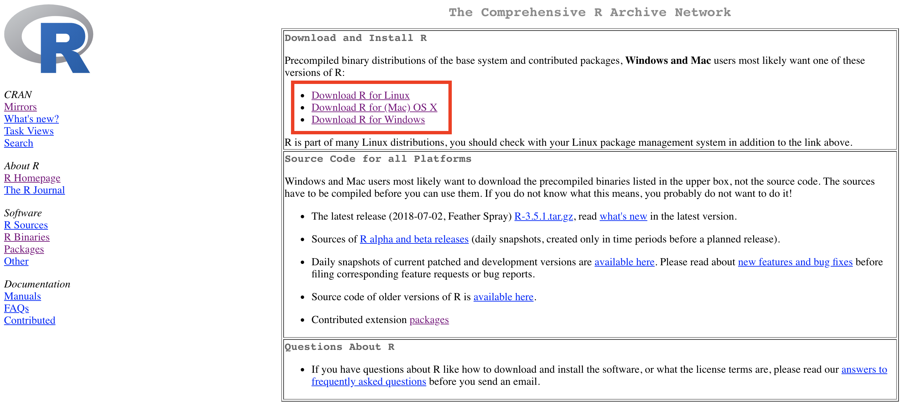

然後點選下載最新版本的安裝檔，其中 Windows 作業系統的二進位檔案副檔名為 .exe；Mac 作業系統的副檔名為 .pkg。

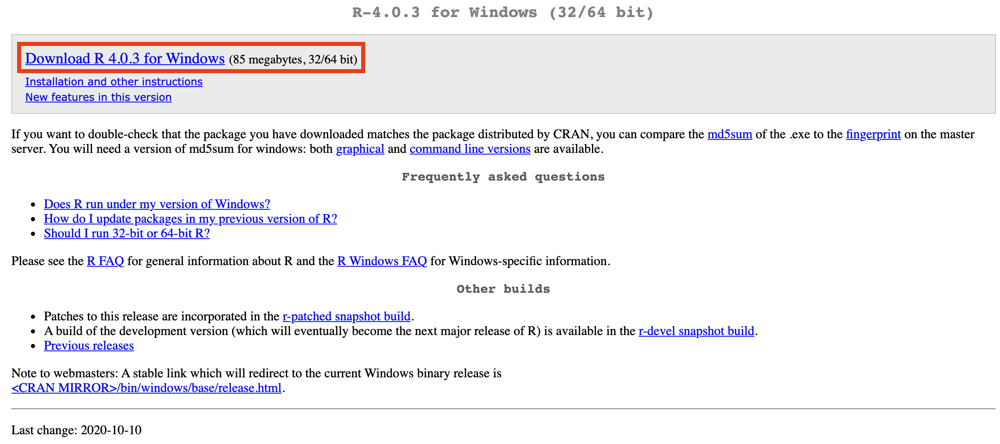

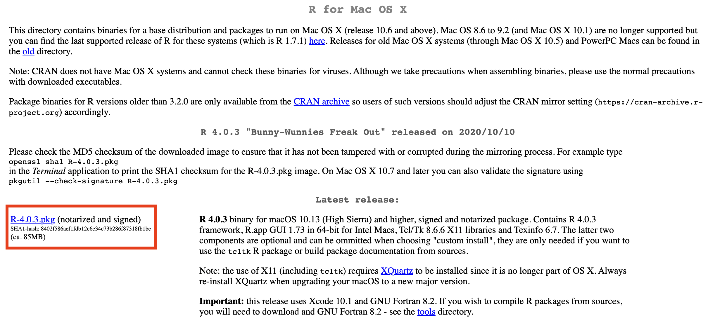

下載完畢之後執行安裝檔，依照提示訊息點選確認或下一步就能完成安裝；其中 Windows 作業系統且電腦為 64 位元的使用者可以選擇不安裝 32 位元的檔案。

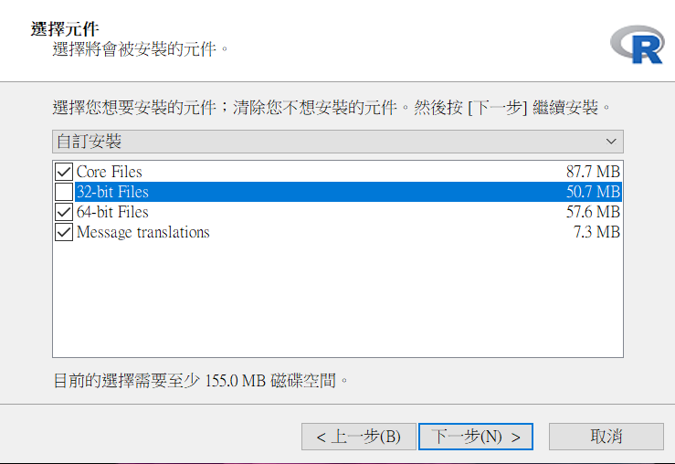

## 開發環境：整合開發環境 RStudio

前往 <https://rstudio.com/products/rstudio/download/>，如果使用的作業系統是 Windows 請點選Windows 10/8/7 — RStudio X.X.XXXX.exe，若是 Mac 作業系統請點選 macOS 10.13+ — RStudio X.X.XXXX.pkg。

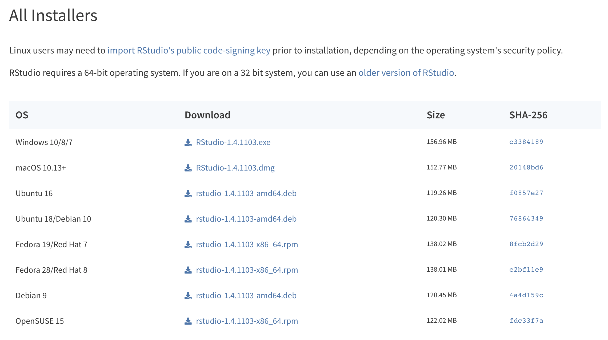

下載完畢之後執行安裝檔，依照提示訊息點選確認或下一步就能完成安裝。

## 啟動 RStudio

安裝完畢以後，啟動 RStudio 的方式與啟動一般軟體的方式相同。Mac 作業系統的使用者能夠在 Launchpad 中找到 RStudio 的圖示執行；或按下 command + 空白鍵（Space） 啟動 Spotlight Search 後輸入 RStudio 執行；Windows 作業系統使用者可以在開始選單中選擇所有程式找到 RStudio；假如 RStudio 安裝程式有產生桌面捷徑，則雙擊桌面捷徑。

## 整合開發環境 RStudio 介面

第一次執行 RStudio 時介面會顯示三個區塊。

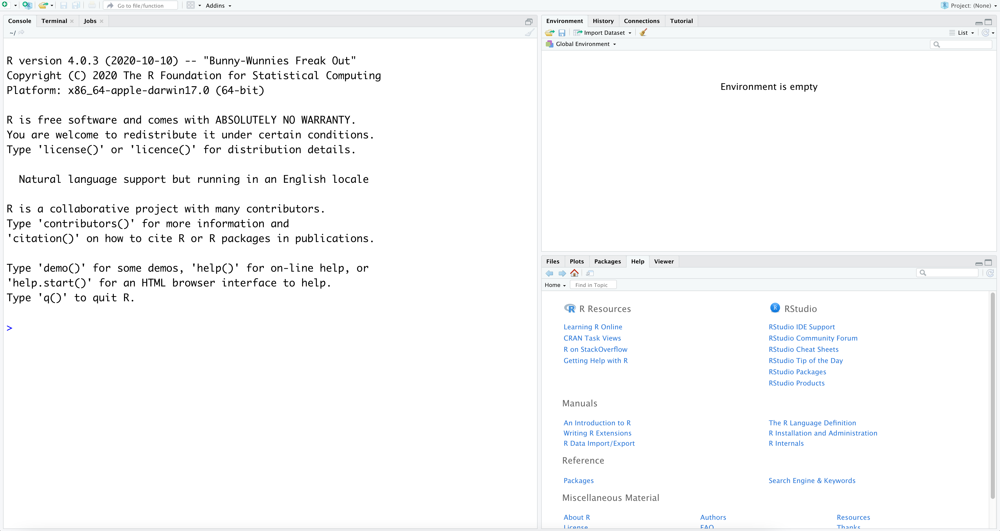

透過點選新增一個 R 程式碼檔案（R Script）將完整的四個區塊都顯示出來。

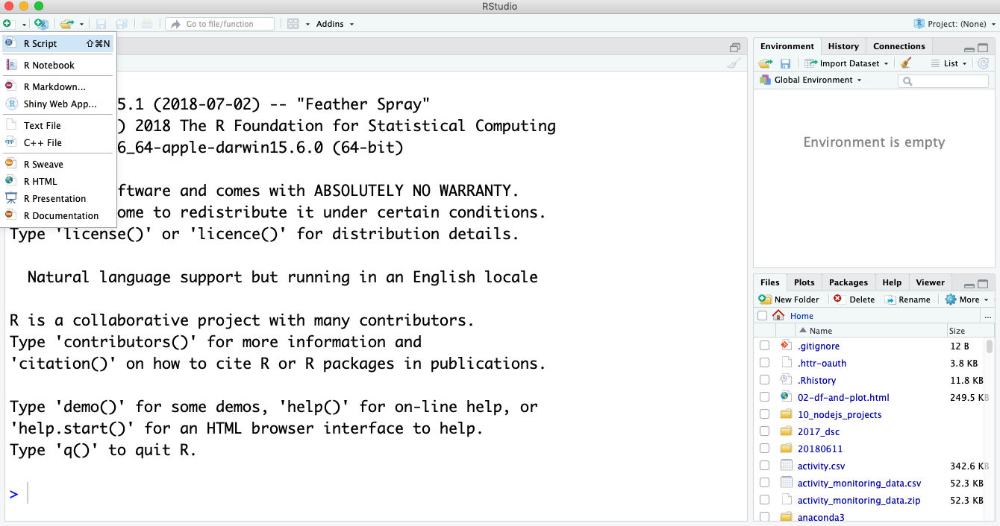

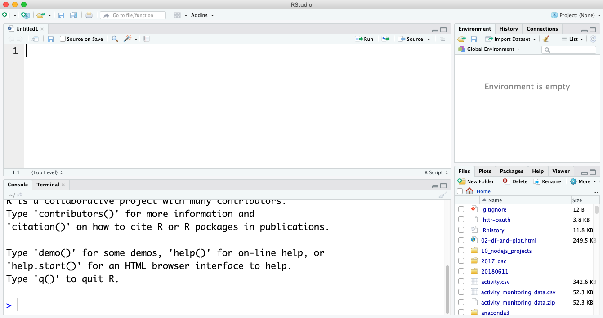

RStudio 介面主要的四個區塊與功能簡介：

1. 來源（Source）：位於左上角，編寫程式的區塊。
2. 命令列（Console）：位於左下角，執行程式且呈現輸出的區塊。
3. 環境與歷史：位於右上角，其中環境（Environment）會顯示出目前可以取用的值（Values）、資料（Data）與函數（Functions）；歷史（History）會顯示在命令列執行過哪些指令。
4. 檔案、圖形、套件、查詢與預覽器：位於右下角，其中檔案（Files）會顯示 R 語言所在的工作目錄（Working Directory）、圖形（Plots）則能瀏覽覺化圖形、套件（Packages）可以觀察套件安裝與載入現況、查詢（Help）能夠檢視使用者查詢的文件以及預覽器（Viewer）是預覽網頁的輸出結果。

離開 RStudio 的方式可以採用：
1.	點擊視窗的 X 離開。
2.	在命令列（Console）輸入 `q()`。

離開時若是環境中有物件存在會詢問是否要儲存您的工作空間，如果您希望下一次啟動時保有目前環境中的物件，可以選擇儲存工作空間（通常我們不會儲存）。

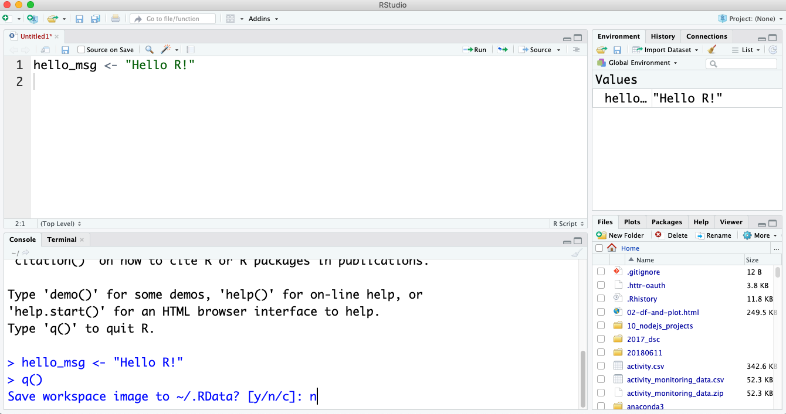

## 挑選 RStudio 佈景主題色彩

整合開發環境 RStudio 能夠做的設定非常多，通常初學者一開始最需要做的是挑選一個自己喜歡的 RStudio 佈景主題，透過點選工具列 Tools、Global Options 就能夠在 Appearance 頁籤選擇一個偏愛的佈景主題色彩（長時間盯著電腦螢幕的使用者通常偏好使用深色的背景減少刺眼的感覺）。

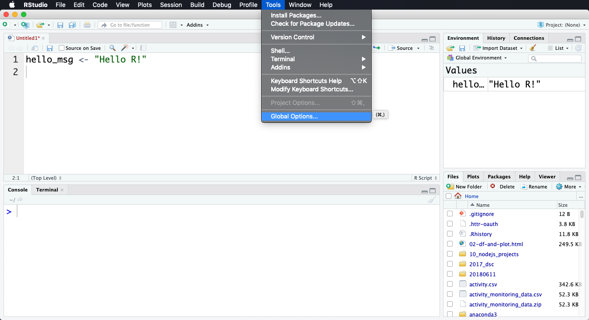

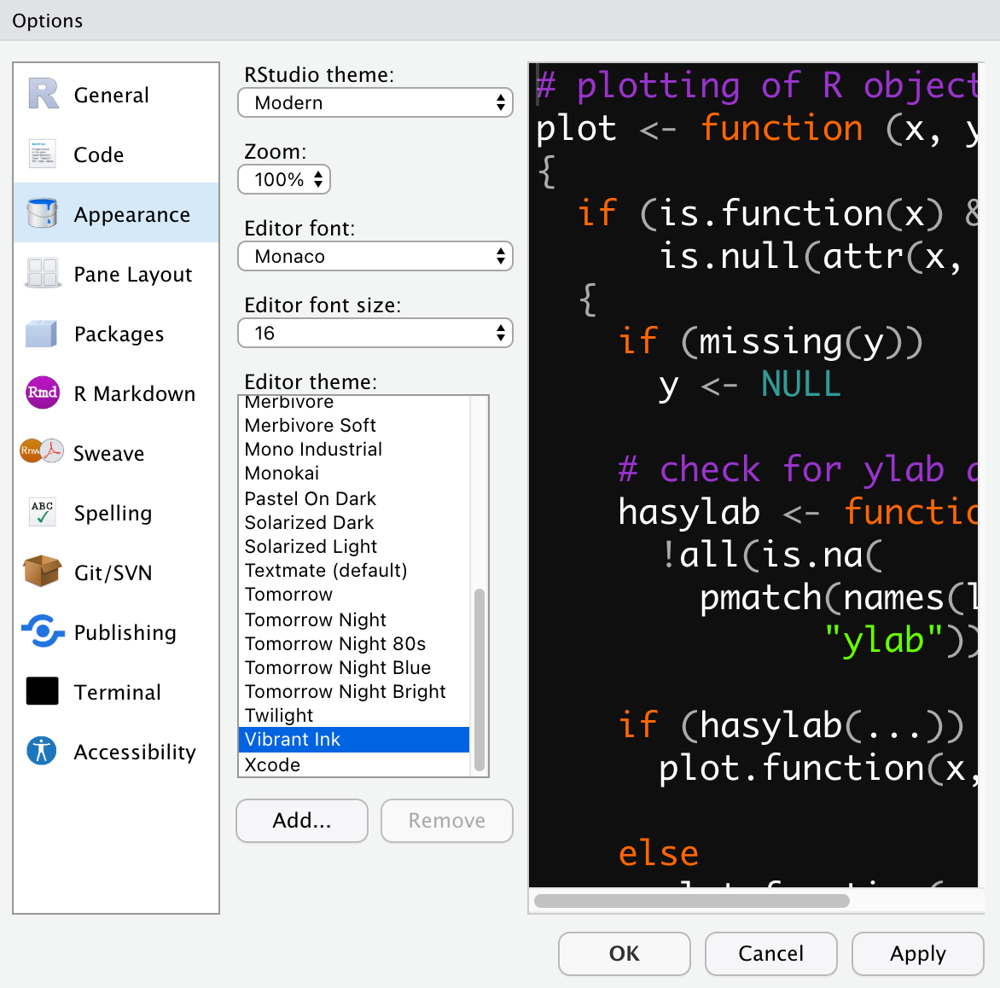

## R 程式設計起步走

學習 R 語言的第一步是認識賦值的符號 `<-` ，它的作用是將其右邊的值指派給符號左邊的物件，舉例來說可以將 `"Hello R!"` 指派給一個叫做 `hello_msg` 的物件（之後我們會嚴格且正式地稱呼它為長度 1 的文字向量），執行過後我們將可以使用 `hello_msg`，例如將它印在 Console 上 `print(hello_msg)` 。在 RStudio 中，我們可以按 alt 與 - 幫我們生成 `<-` 符號。`<-` 符號跟其他程式語言的 `=` 符號功能是完全相同的。事實上在 R 語言中使用 `=` 符號來賦值也是完全沒問題，但因為絕大多數的 R 語言使用者仍然習慣使用 `<-` 符號，我還是推薦您使用 `<-` 符號。

```{r}
hello_msg <- "Hello R!"
hello_msg
```

在為物件命名的時候，請遵守三個 R 語言使用者的寫作風格：

1.	使用全小寫英文，不同單字之間以底線 _ 相隔。
2.	使用英文名詞為值（Values）和資料（Data）命名、使用英文動詞為函數（Functions）命名，讓名稱簡潔且具有意義。
3.	避免使用保留字與內建函數作為物件的命名。

接著要認識 `#` 符號，在該符號後面編寫註解，用口語方式告訴別人這段程式在做什麼事情。

```{r}
# 好的 R 物件命名
taiwan_number_one <- TRUE
taiwan_number_1 <- TRUE
taiwanNumberOne <- TRUE

# 不好的 R 物件命名
Taiwan_Number_One <- TRUE
TaiwanNumberOne <- TRUE
twno1 <- TRUE

# 更多不好的 R 物件命名
T <- FALSE                 # T 是保留字 TRUE
c <- 10                    # c() 為內建函數
mean <- function(x) {      # mean() 為內建函數
  return(-x)
}
```

## 簡單常用的 R 內建函數

呼叫 `print()` 函數或物件名稱可以將物件內容輸出在 Console。

```{r}
hello_msg <- "Hello R!"
print(hello_msg)
hello_msg
```

呼叫 `rm()` 函數將完成賦值的物件自環境中刪除，rm 是 remove 的縮寫。

```{r error = TRUE}
hello_msg <- "Hello R!"
print(hello_msg)
rm(hello_msg)
print(hello_msg)
```

呼叫 `help()` 函數查詢資料以及函數的說明文件。

```{r}
help(iris)  # 查詢資料，也可以使用 ?iris
help(print) # 查詢函數，也可以使用 ?print
```

呼叫 `sessionInfo()` 顯示 R 語言的版本與相關資訊。

```{r}
sessionInfo()
```

呼叫 `Sys.getlocale()` 顯示 R 語言的地區以及語言資訊。

```{r}
Sys.getlocale()
```

呼叫 `getwd()` 顯示 R 語言的工作目錄，wd 為 working directory 的縮寫。

```{r}
getwd()
```

呼叫 setwd() 設定 R 語言的工作目錄，此處 Windows 使用者要特別注意路徑斜線要使用 / 正斜線（而非 Windows 作業系統使用的 \ 反斜線），並且避免在路徑設定上出現空格與非英文的文字。

```{r eval = FALSE}
setwd("/Users/YOURUSERNAME/Desktop")   # 將 MacOS 桌面設為工作目錄
setwd("C:/Users/YOURUSERNAME/Desktop") # 將 Windows 桌面設為工作目錄，特別注意路徑斜線要使用 / 正斜線
```

## R Console 一直出現 + 的故障排除

R 語言的 Console 在預期使用者未完成輸入的時候會持續出現 + 提示尚有指令需要輸入，常見的情景像是應該成對出現的雙引號、小括號、中括號與大括號，卻並沒有輸入完整。

```{r eval = FALSE}
# 遺漏右邊的雙引號
my_fav_pg <- "Steve Nash
## > # 遺漏右邊的雙引號
## > my_fav_pg <- "Steve Nash
## +
# 遺漏右邊的小括號
print("Steve Nash"
## > # 遺漏右邊的小括號
## > print("Steve Nash"
## +
# 遺漏右邊的中括號
iris[1, 1
## > # 遺漏右邊的中括號
## > iris[1, 1
## +
# 遺漏右邊的大括號
say_hello <- function(){
  return("Hello R!")
## > # 遺漏右邊的大括號
## > say_hello <- function(){
## +   return("Hello R!")
## +
```

我們有兩種方式排除這個故障，一是在 `+` 之後完成遺漏的輸入，另一則是在 Console 按 Esc 鍵離開，重新來過。

## 小結

在 Chapter \@ref(gettingStarted)，我們簡介 R 語言的特性、開發環境、啟動 RStudio、RStudio 介面、如何挑選 RStudio 佈景主題色彩、R 程式設計起步走、簡單常用的 R 內建函數以及如何排除 R Console 一直出現 `+` 的故障。