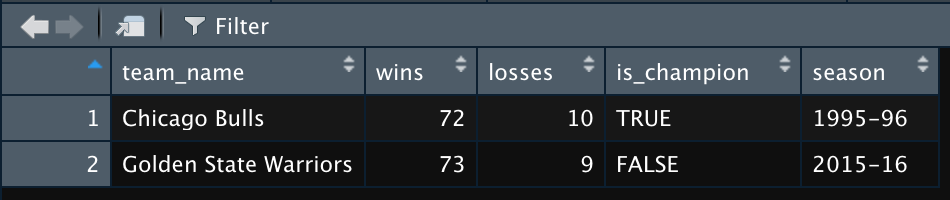

# 其他資料結構 {#otherDataStructures}

> R’s base data structures can be organized by their dimensionality and whether they’re homogeneous or heterogeneous.
> 
> Hadley Wickham

在認識向量、操作向量中我們已經知道 R 語言的基本資料單位稱作向量（`vector`），向量扮演的角色就像是樂高、積木、模型或拼圖等遊戲中的基本單元零件，透過結合基本資料單位，堆疊出更進階的應用。接下來我們要認識利用向量所組成的資料結構，這些資料結構包含彈性的容器：清單（`list`）、現代化表格：資料框（`data.frame`）、有階層資訊的向量：因素向量（`factor`）、兩個維度的向量：矩陣（`matrix`）與多個維度的向量：陣列（`array`）。

## 彈性的容器：清單（list）

我們目前熟悉的向量只能被宣告為單一類型，這是為了便利科學計算（Element-wise operation）而伴隨產生的侷限，然而在應用上很多不同類型的資料有被儲存在同一個物件中的需求，舉例而言，我想要紀錄 1995 至 1996 年間芝加哥公牛隊的一些資訊，像是隊伍的名稱、球季、勝場數、敗場數、先發五人與是否獲得總冠軍，若是以向量儲存，會在賦值成功後因為其中存在有文字向量，所有的資料都會成為文字向量。

```{r}
team_name <- "Chicago Bulls"
season <- "1995-1996"
wins_losses <- c(72, 10)
starting_lineup <- c("Ron Harper", "Michael Jordan", "Scottie Pippen", "Dennis Rodman", "Luc Longley")
is_champion <- TRUE
chicago_bulls <- c(team_name, season, wins_losses, starting_lineup, is_champion)
class(chicago_bulls)
chicago_bulls
```

這時候我們可以使用 R 語言中的 `list` 資料結構儲存任何型別、長度與外觀的資料，改利用 `list()` 函數（而非 `c()` 函數）將宣告好的不同類型向量收納到一個物件 `chicago_bulls` 之中。

```{r}
team_name <- "Chicago Bulls"
season <- "1995-1996"
wins_losses <- c(72, 10)

starting_lineup <- c("Ron Harper", "Michael Jordan", "Scottie Pippen", "Dennis Rodman", "Luc Longley")
is_champion <- TRUE
chicago_bulls <- list(
  team_name,
  season,
  wins_losses,
  starting_lineup,
  is_champion
)
class(chicago_bulls)
chicago_bulls
```

印出 `chicago_bulls` 觀察就可以看到清單強大的收納能力，它並不像 `c()` 函數把各個向量合併起來，而是用數個雙層中括號 `[[]]` 將各個向量依順序放入一個物件之中，這時候要選擇裡面的物件，就改使用雙層中括號 `[[索引值]]` ，在這個清單之中，我們儲存了五個不同類型的向量，依序是長度 1 的文字向量（隊伍名稱）、長度 1 的文字向量（球季）、長度 2 的數值向量（勝場數與敗場數）、長度 5 的文字向量（先發五人）與長度 1 的邏輯值向量（是否獲得總冠軍），在清單中，各個向量依然保有自己的類型，但是可以被儲存至一個物件中。

```{r}
team_name <- "Chicago Bulls"
season <- "1995-1996"
wins_losses <- c(72, 10)
starting_lineup <- c("Ron Harper", "Michael Jordan", "Scottie Pippen", "Dennis Rodman", "Luc Longley")
is_champion <- TRUE
chicago_bulls <- list(
  team_name,
  season,
  wins_losses,
  starting_lineup,
  is_champion
)
class(chicago_bulls)
class(chicago_bulls[[1]])
class(chicago_bulls[[2]])
class(chicago_bulls[[3]])
class(chicago_bulls[[4]])
class(chicago_bulls[[5]])
```

建立清單的同時，如果我們有給予向量名稱，可以在選擇資料時使用 `[[索引值]]` 、 `[["名稱"]]` 或 `$名稱` ，稱為有名稱的清單（Named list）。

```{r}
team_name <- "Chicago Bulls"
season <- "1995-1996"
wins_losses <- c(72, 10)
starting_lineup <- c("Ron Harper", "Michael Jordan", "Scottie Pippen", "Dennis Rodman", "Luc Longley")
is_champion <- TRUE
chicago_bulls <- list(
  teamName = team_name,
  season = season,
  winsLosses = wins_losses,
  startingLineup = starting_lineup,
  isChampion = is_champion
)
# 使用 [[索引值]]
chicago_bulls[[1]]
chicago_bulls[[2]]
chicago_bulls[[3]]
chicago_bulls[[4]]
chicago_bulls[[5]]

# 使用 [["名稱"]]
chicago_bulls[["teamName"]]
chicago_bulls[["season"]]
chicago_bulls[["winsLosses"]]
chicago_bulls[["startingLineup"]]
chicago_bulls[["isChampion"]]
# 使用 $名稱
chicago_bulls$teamName
chicago_bulls$season
chicago_bulls$winsLosses
chicago_bulls$startingLineup
chicago_bulls$isChampion
```

既然可以選擇出清單中裝的五個向量，就可以自由運用各個向量中的資料，例如計算這個賽季芝加哥公牛隊的勝率。

```{r}
team_name <- "Chicago Bulls"
season <- "1995-1996"
wins_losses <- c(72, 10)
starting_lineup <- c("Ron Harper", "Michael Jordan", "Scottie Pippen", "Dennis Rodman", "Luc Longley")
is_champion <- TRUE
chicago_bulls <- list(
  teamName = team_name,
  season = season,
  winsLosses = wins_losses,
  startingLineup = starting_lineup,
  isChampion = is_champion
)

wins <- chicago_bulls[["winsLosses"]][1]
losses <- chicago_bulls[["winsLosses"]][2]
winning_percentage <- wins / (wins + losses)
sprintf("%s 在 %s 球季的勝率是 %.2f%%",
        chicago_bulls$teamName,
        chicago_bulls$season,
        winning_percentage * 100)
```

清單的強大收納能力讓她能夠儲存任何資料結構，包含清單亦可以被收納入清單之中，成為巢狀清單（nested list），例如改採用清單記錄勝場數、敗場數與先發五人的資訊。

```{r}
team_name <- "Chicago Bulls"
season <- "1995-1996"
wins_losses <- list(
  wins = 72,
  losses = 10

)
starting_lineup <- list(
  PG = "Ron Harper",
  SG = "Michael Jordan",
  SF = "Scottie Pippen",
  PF = "Dennis Rodman",
  C = "Luc Longley"
)
is_champion <- TRUE
chicago_bulls <- list(
  teamName = team_name,
  season = season,
  winsLosses = wins_losses,
  startingLineup = starting_lineup,
  isChampion = is_champion
)
sprintf("%s 在 %s 球季的先發得分後衛是 %s",
        chicago_bulls$teamName,
        chicago_bulls$season,
        chicago_bulls$startingLineup$SG)
```

清單是 R 語言中一個極為重要的資料結構，在後續的章節中我們會再探討如何應用清單在函數輸出與 JSON 格式資料的讀取。

## 現代化表格：資料框（data.frame）

資料框（Dataframe）是 R 語言用來處理表格式資料（tabular data）的資料結構，它的外觀具有列與欄兩個維度，具備列索引值與欄索引值來支援使用者，並容許每一個欄位（變數）具有自己的型別，使用 R 語言讀取外部地表格式資料也會以資料框的結構儲存。
我們可以運用 `data.frame()` 函數手動創造資料框，讓我們建立一個很簡單的資料框叫做 `great_nba_teams`，這個資料框有隊名、勝場數、敗場數、是否獲得總冠軍與球季。

```{r eval = FALSE}
team_name <- c("Chicago Bulls", "Golden State Warriors")
wins <- c(72, 73)
losses <- c(10, 9)
is_champion <- c(TRUE, FALSE)
season <- c("1995-96", "2015-16")

great_nba_teams <- data.frame(team_name, wins, losses, is_champion, season)
View(great_nba_teams)
```



除了將資料框直接印出在 Console，針對資料框 R 語言使用者更習慣使用 `View()` 函數（請注意這個函數的 V 是大寫！）瀏覽資料框的外觀與內容。我們使用觀測值（Observations）來稱呼資料框中水平方向的資料，使用變數（Variables）來稱呼資料框中垂直方向的資料；資料框能夠以 `[m, n]` 兩個索引值來搭配選擇，其中 `m` 是資料框的觀測值個數， `n` 是資料框的變數個數，因此一個資料框的外觀可以簡潔地以 m x n 來描述，例如手動創建的資料框 great_nba_teams 外觀為 2 x 5。

```{r}
team_name <- c("Chicago Bulls", "Golden State Warriors")
wins <- c(72, 73)
losses <- c(10, 9)
is_champion <- c(TRUE, FALSE)
season <- c("1995-96", "2015-16")

great_nba_teams <- data.frame(team_name, wins, losses, is_champion, season)
great_nba_teams[1, 1] # 選出第一個變數的第一個觀測值 "Chicago Bulls"
great_nba_teams[1, ]  # 選出第一個觀測值
great_nba_teams[, 1]  # 選出第一個變數
```

資料框支援使用變數名稱來選擇，我們可以用 `$變數名稱`或者 `[, "變數名稱"]` 這兩種寫法。

```{r}
team_name <- c("Chicago Bulls", "Golden State Warriors")
wins <- c(72, 73)
losses <- c(10, 9)
is_champion <- c(TRUE, FALSE)
season <- c("1995-96", "2015-16")


great_nba_teams <- data.frame(team_name, wins, losses, is_champion, season)
great_nba_teams$team_name
great_nba_teams[, "season"]
```

我們也可以透過邏輯值向量來對資料框進行篩選，選出最終有獲得總冠軍的隊伍。在這裡一定要注意篩選是針對觀測值（水平方向），所以要將邏輯值向量放在逗號前面，逗號後面留空（並沒有要選擇變數。）

```{r}
team_name <- c("Chicago Bulls", "Golden State Warriors")
wins <- c(72, 73)
losses <- c(10, 9)
is_champion <- c(TRUE, FALSE)
season <- c("1995-96", "2015-16")

great_nba_teams <- data.frame(team_name, wins, losses, is_champion, season)
won_champion <- great_nba_teams$is_champion
great_nba_teams[won_champion, ]
```

資料框能包含多種向量類型，有文字向量（`team_name`、`season`）、數值向量（`wins`、`losses`）與邏輯值向量（`is_champion`），可以透過 `str()` 函數（structure 的縮寫）檢視組成資料框的向量類型。

```{r}
team_name <- c("Chicago Bulls", "Golden State Warriors")
wins <- c(72, 73)
losses <- c(10, 9)
is_champion <- c(TRUE, FALSE)
season <- c("1995-96", "2015-16")

great_nba_teams <- data.frame(team_name, wins, losses, is_champion, season)
str(great_nba_teams)
```

資料科學團隊通常花費很多的時間與資料框周旋，常應用於探索資料框的函數以及進階的資料框操控技巧會在後續章節詳細探討。

## 有階層資訊的向量：因素向量（factor）

R 語言針對向量有一個額外的資料結構稱為因素向量（factor），這是一種具有層級（levels）資訊的向量，我們可以使用 `factor()` 函數將一般的向量轉換成因素向量。

```{r}
four_seasons <- c("spring", "summer", "autumn", "winter")
four_seasons
class(four_seasons) # 文字向量
four_seasons_factor <- factor(four_seasons)
four_seasons_factor
class(four_seasons_factor) # 因素向量
```

在 Console 印出因素向量時會將層級的資訊輸出，預設的層級是以字母順序排列（由 A 排至 Z），而在轉換為因素向量的函數 `factor()` 之中利用 `ordered = TRUE` 與 `levels` 參數可以依照使用者的偏好做排列。

```{r}
four_seasons <- c("spring", "summer", "autumn", "winter")
four_seasons_factor <- factor(four_seasons, ordered = TRUE, levels = c("summer", "winter", "spring", "autumn"))
four_seasons_factor
```

這時在 Console 印出的因素向量除了層級、各個層級之間彼此還有大小的關係資訊，而通常有排序的因素向量適合用在意義有隱含順序的文字向量，像是形容溫度的文字。

```{r}
temperatures <- c("warm", "hot", "cold")
temperatures_factor <- factor(temperatures, ordered = TRUE, levels = c("cold", "warm", "hot"))
temperatures_factor
```

假如只有指定 `ordered = TRUE` 但沒有指定 `levels`，R 語言會預設使用字母順序排序，可能就會產生不符合直覺的排序。

```{r}
temperatures <- c("warm", "hot", "cold")
temperatures_factor <- factor(temperatures, ordered = TRUE)
temperatures_factor
```

## 兩個維度的向量：矩陣（matrix）

矩陣與資料框相同是能夠儲存列（Row）與欄（Column）的資料結構，如果對於分辨行、列與欄這些中文字有障礙的話，我非常推薦用英文來記憶：Row 指的是水平方向資料，Column 指的是垂直方向資料。通用的習慣是先 Row 後 Column，假如我們現在要建立一個 2x3 的矩陣，意思就是兩個水平方向搭配三個垂直方向的矩陣。使用 `matrix()` 函數並指定參數 `nrow = 2` 將一維的數字向量（1 到 6）轉換成一個 2x3 的矩陣；往後如果聽到一個矩陣是 mxn 或者 (m, n) 的外觀，我們心中就會知道，這個矩陣具有 m 個水平方向資料，n 個垂直方向資料。

```{r}
my_mat <- matrix(1:6, nrow = 2)
my_mat
class(my_mat)
```

`matrix()` 函數還有一個 `byrow` 的參數可以指定要用什麼順序擺放原先在向量中的元素，雖然這個矩陣的外觀仍然是 2x3，但六個數字擺放的方向變為水平的。 `byrow` 參數的預設值為 `FALSE`，意思是如果我們沒有特別指定，就是以垂直的方向來擺放矩陣。

```{r}
my_mat <- matrix(1:6, nrow = 2, byrow = TRUE)
my_mat
```

矩陣同樣能夠以 `[]` 搭配索引值選出裡面的變數，不過跟向量不同的是現在有兩個維度的索引值必須指定，所以要用 `[m, n]` 兩個索引值來搭配選擇。

```{r}
my_mat <- matrix(1:6, nrow = 2)
my_mat[2, 3] # 選出位於（2, 3）這個位置的 6
my_mat[2, ]  # 選出所有第二列（2nd row）的元素
my_mat[, 3]  # 選出所有第三欄（3rd column）的元素
```

我們也可以透過邏輯值向量來對矩陣進行篩選，選出大於 1 且小於 6 的數字。

```{r}
my_mat <- matrix(1:6, nrow = 2)
my_mat < 6 & my_mat > 1
my_mat[my_mat < 6 & my_mat > 1]
```

矩陣由向量所建構而成，除了多一個維度之外，其餘特性都很相似，例如我們將數值向量與邏輯值向量合併放入矩陣，則邏輯值向量亦會被自動轉換成數值向量，進而就成為一個數值矩陣。

```{r}
my_mat <- matrix(c(1, 2, TRUE, FALSE, 3, 4), nrow = 2)
my_mat
```

## 多個維度的向量：陣列（array）

陣列（array）是矩陣的多維度版本，除了原有的水平方向資料（Row）與垂直方向資料（Column）我們可以再多指定 n 個維度，簡單來說，就是在一個陣列的物件之中，可以允許儲存多個矩陣。舉例來說我們就可以用陣列將 1 到 20 這 20 個數字儲存在 5 個 2x2 的矩陣之中。

```{r}
my_arr <- array(1:20, dim = c(2, 2, 5))
class(my_arr)
my_arr
```

因為現在有了三個維度，所以在使用索引值選擇時，就需要增加第三個維度的索引值。

```{r}
my_arr <- array(1:20, dim = c(2, 2, 5))
my_arr[, , 1] # 第一個矩陣
my_arr[, , 2] # 第二個矩陣
my_arr[, , 3] # 第三個矩陣
my_arr[, , 4] # 第四個矩陣
my_arr[, , 5] # 第五個矩陣
```

既然可以選擇出裡頭的五個矩陣，自然也可以深入選擇出其中數字、其中一個 row 或其中一個 column，像是選出 7 可以使用 `[1, 2, 2]` 、選出第二個矩陣的第一個 row 可以使用 `[1, , 2]`、選出第二個矩陣的第二個 column 可以使用 `[, 2, 2]`。

```{r}
my_arr <- array(1:20, dim = c(2, 2, 5))
my_arr[1, 2, 2] # 選出 7
my_arr[1, , 2]  # 選出第二個矩陣的第一個 row
my_arr[, 2, 2]  # 選出第二個矩陣的第二個 column
```

## 小結

在 Chapter \@ref(otherDataStructures) 中我們簡介向量以外的資料結構，包含 R 語言中的清單（list）、資料框（data.frame）、因素向量（factor）、矩陣（matrix）與陣列（array）。