--- 
title: "輕鬆學習 R 語言"
author: "郭耀仁"
#date: "`r Sys.Date()`"
site: bookdown::bookdown_site
documentclass: book
bibliography: [book.bib, packages.bib]
biblio-style: apalike
link-citations: yes
description: "從基礎到應用，掌握資料科學的關鍵能力。"
---

# 關於本書

Placeholder


## 誰是本書的目標讀者
## 誰可能不是本書的目標讀者
## 程式區塊
## 環境與版本

<!--chapter:end:index.Rmd-->


# 起步走 {#gettingStarted}

Placeholder


## 開發環境：直譯器 R
## 開發環境：整合開發環境 RStudio
## 啟動 RStudio
## 整合開發環境 RStudio 介面
## 挑選 RStudio 佈景主題色彩
## R 程式設計起步走
## 簡單常用的 R 內建函數
## R Console 一直出現 + 的故障排除
## 小結

<!--chapter:end:02-getting-started.Rmd-->


# 其他資料結構 {#otherDataStructures}

Placeholder


## 彈性的容器：清單（list）
## 現代化表格：資料框（data.frame）
## 有階層資訊的向量：因素向量（factor）
## 兩個維度的向量：矩陣（matrix）
## 多個維度的向量：陣列（array）
## 小結

<!--chapter:end:06-other-data-structures.Rmd-->

# 網頁資料擷取 {#webScraping}

> The world’s most valuable resource is no longer oil, but data.
>
> The Economist

獲取資料（Getting Data）在資料科學專案中扮演攻擊發起點，如果這個專案目的是協助我們制定資料驅動的策略（data-driven strategy），而非傳統倚賴直覺的「根據經驗」策略，那麼為專案細心盤點資料來源與整理獲取方法，將可以為決策奠基穩固的基礎。常見的資料來源可以分為三種：
1.	檔案。
2.	資料庫。
3.	網頁資料擷取。

在資料輸入與輸出我們討論了如何透過 R 語言載入表格式檔案（包含 CSV 資料、Excel 試算表）、非表格式檔案（包含 TXT 資料、JSON 資料）；在向資料庫查詢我們簡介如何以 R 語言透過 DBI 與 RSQLite 兩個套件連結本機端的 SQLite 資料庫，並利用 DBI 套件所提供的函數實踐四種常見資料庫表格操作，即所謂的 CRUD：Create、Read、Update 與 Delete。這個小節我們要討論第三種資料來源：網頁，而從網頁擷取資料的技巧，有著另外一個更為眾人耳熟能詳的名稱：網站爬蟲。

## 網站爬蟲的核心任務

網站爬蟲的核心任務可以簡單區分為兩個：請求資料（requesting data）與解析資料（parsing data）；其中請求資料的運作就像我們在瀏覽器中輸入網址一般，只不過送出請求的管道由瀏覽器改變成為 R 語言程式碼；解析資料的運作則是將伺服器回傳的資料內容去蕪存菁，萃取必要的一小部分。
接著我們可依照解析資料的複雜程度將任務再細分為三類：JSON（全名為 JavaScript Object Notation，一種輕量級的資料交換格式）、XML（全名為 Extensible Markup Language）與 HTML（全名為 HyperText Markup Language）。很多的 Web API（全名為 Web Application Programming Interface，意即建構於網站伺服器的應用程式介面，作為不同系統之間的資料傳遞管道）其資料格式皆約定為 JSON 與 XML。如果資料格式是 JSON 在請求資料之後會以 R 語言的 `list` 或 `data.frame` 結構儲存，幾乎沒有額外的解析需求；假使資料格式是標記語言（XML 或 HTML），則會需要繼續以 XPath（提供在 XML/HTML 資料中以 XML 節點找尋特定資料位置的定位方法）或 CSS Selector（提供在 HTML 資料中以層疊樣式表找尋特定資料位置的定位方法）來解析。

## 安裝與載入套件

在這個小節中我們主要應用作為網頁資料擷取的套件是 jsonlite、xml2、magrittr 與 rvest，其中 magrittr 是為了使用 `%>%` 搭配 rvest 中的函數、xml2 是 rvest 的依賴套件，因此安裝時只需指定 jsonlite、rvest 與 magrittr 即可。
我們可以選擇透過命令列（Console）以 `install.packages()` 函數進行安裝。

```{r eval=FALSE}
# 安裝 jsonlite、rvest 與 magrittr
pkgs <- c("jsonlite", "rvest", "magrittr")
install.packages(pkgs)
```

或是透過圖形化介面（Graphic User Interface, GUI）的方法安裝，在右下角的 packages 頁籤點選 install，再輸入套件名稱接著點選安裝。

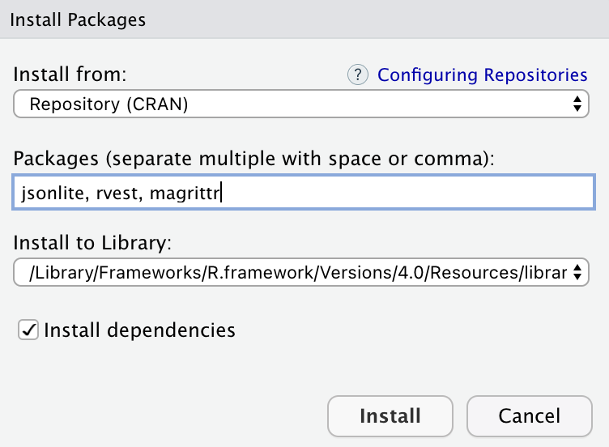

我們可以選擇透過命令列（Console）以 `library()` 函數將套件載入環境來使用。

```{r}
# 載入 jsonlite、rvest 與 magrittr
library(jsonlite)
library(rvest)
library(magrittr)
```

或是透過圖形化介面（Graphic User Interface, GUI）在右下角的 packages頁籤下搜尋然後將前面的核取方框打勾。

## 擷取 JSON 格式資料

接著我們以 jsonlite 套件中的 `fromJSON()` 函數示範擷取政府資料開放平台：空氣品質指標（AQI）所提供的 Web API 將 JSON 格式資料載入 R 語言中，由於該 Web API 提供的是 Array of JSON，因此擷取之後的資料結構是 `data.frame`。

```{r}
# 安裝 jsonlite、rvest 與 magrittr
#pkgs <- c("jsonlite", "rvest", "magrittr")
#install.packages(pkgs)
# 載入 jsonlite
library(jsonlite)

aqi_url <- "https://opendata.epa.gov.tw/ws/Data/AQI/?$format=json"
aqi <- fromJSON(aqi_url)
class(aqi)
head(aqi)
```

同樣以 jsonlite 套件中的 `fromJSON()` 函數示範擷取 data.nba.net 所提供的 Web API 將 JSON 格式資料載入 R 語言中，這時由於該 Web API 提供的是 JSON，擷取之後的資料結構則會是 `list`。

```{r}
# 安裝 jsonlite、rvest 與 magrittr
#pkgs <- c("jsonlite", "rvest", "magrittr")
#install.packages(pkgs)
# 載入 jsonlite
library(jsonlite)

nba_url <- "https://data.nba.net/prod/v1/2020/players.json"
nba_players <- fromJSON(nba_url)
class(nba_players)
paste(nba_players$league$standard$firstName, nba_players$league$standard$lastName)[1:10]
```

## 擷取 XML 格式資料

接著我們利用 xml2 套件示範擷取政府資料開放平台：空氣品質指標（AQI）所提供的 Web API 將 XML 格式資料載入 R 語言中，使用 `read_xml()` 函數之後獲得的資料結構是命名為 xml_document 的 `list`，面對 xml_document 可以呼叫 xml2 套件提供的 `xml_find_all()` 與 `xml_text()` 函數指定 XPath 並解析出文字格式的資料。

```{r}
# 安裝 jsonlite、rvest 與 magrittr
#pkgs <- c("jsonlite", "rvest", "magrittr")
#install.packages(pkgs)
# 載入 xml2, magrittr
library(xml2)
library(magrittr)

aqi_url <- "https://opendata.epa.gov.tw/ws/Data/AQI/?$format=xml"
aqi <- read_xml(aqi_url)
class(aqi)
site_names <- aqi %>%
  xml_find_all(xpath = "//Data/SiteName") %>%
  xml_text()
class(site_names)
site_names
```

## 擷取 HTML 格式資料

向伺服器發送請求後若是獲得 HTML 格式資料，將需要進行較複雜的解析任務，原因是請求後的 HTML 文件包含了太多不需要的資訊，諸如包含在 `<style></style>` 標籤中的 CSS（Cascading Style Sheets，階層樣式表）語言或者包含在 `<script></script>` 標籤中的 JavaScript 語言。
所以熟練定位網頁中特定資料位址的技巧就變得十分重要，如同在地圖上加入標記（Marker）一般，我們需要景點或建築物的位址，可以是門牌號碼、詳細地址甚至是精準的經緯度。在網頁上標記資料為止有非常多方法能夠表示，常見的像是使用：

- HTML 的標籤名稱。
- HTML 標籤中給予的 id。
-	HTML 標籤中給予的 class。
-	CSS 選擇器（CSS Selector）。
-	XPath。

考量多數資料科學愛好者並不具備網頁工程師的背景技能，透過 Chrome 瀏覽器的外掛來取得資料所在的 CSS 選擇器或者 XPath 是快速入門的捷徑。

## Chrome 瀏覽器外掛：Selector Gadget

透過下列步驟將 Selector Gadget 外掛加入 Chrome 瀏覽器。

1. 前往 Chrome Web Store，點選外掛（Extensions）。

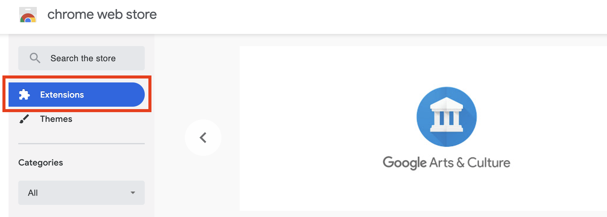

2. 搜尋 Selector Gadget 並點選加入到 Chrome 瀏覽器。

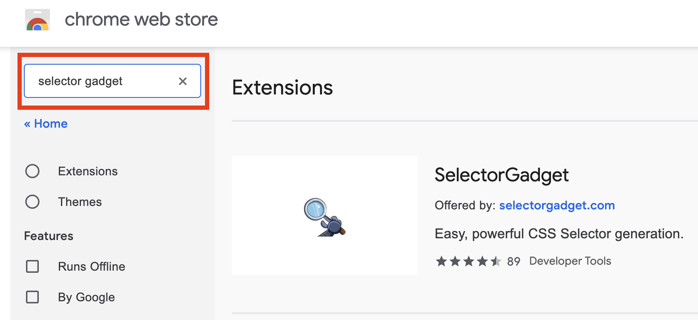

3. 確認要加入 Selector Gadget。

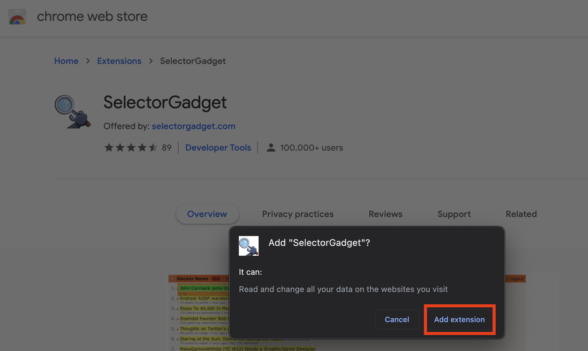

依照下列步驟定位 HTML 格式資料的 CSS 選擇器。

1. 點選 Selector Gadget 的外掛圖示。

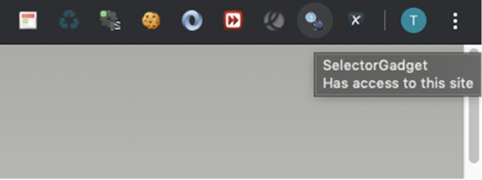

2. 留意 Selector Gadget 的 CSS 選擇器。

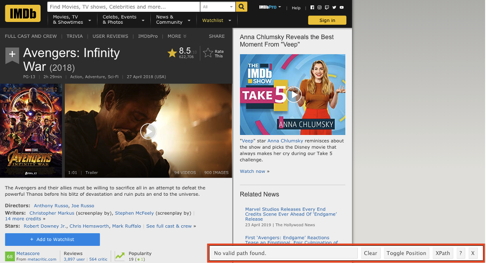

3. 移動滑鼠到想要定位的元素。

4. 在想要定位的評分上面點選左鍵，留意此時的 CSS 選擇器位址與資料筆數，通常在第一次點擊後網頁上很多的資料都會同時被選到（以黃底標記），Clear 後面數字表示有多少筆。

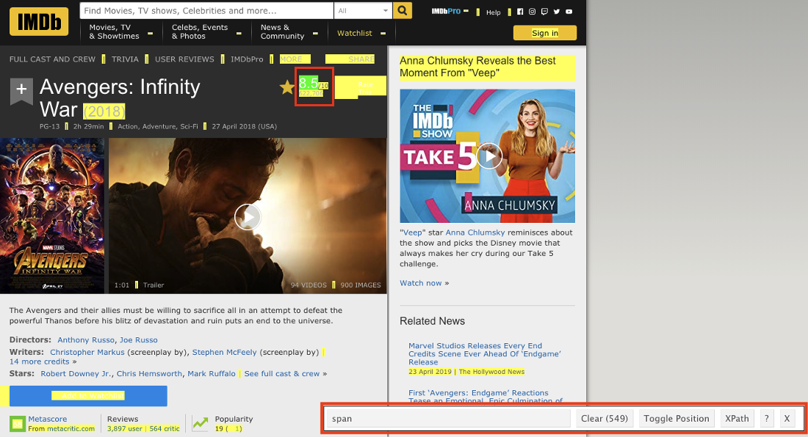

5. 移動滑鼠點選不要選擇的元素（改以紅底標記），並同時注意 CSS 選擇器位址與資料筆數的變動，當資料筆數與預期相符時表示完成定位。

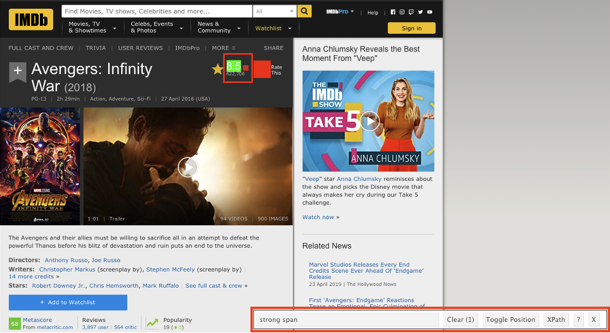

我們以 IMDB.com 的 Avengers: Infinity War (2018) 頁面示範如何以 CSS 選擇器定位評等。
利用 rvest 套件的 `read_html()` 函數將 HTML 資料格式讀入，獲得的資料結構同樣是命名為 xml_document 的 `list`，面對 xml_document 可以呼叫 rvest 套件提供的 `html_nodes()` 與 `html_text()` 函數指定 CSS 選擇器解析出文字格式的資料。

```{r}
# 安裝 jsonlite、rvest 與 magrittr
#pkgs <- c("jsonlite", "rvest", "magrittr")
#install.packages(pkgs)
# 載入 rvest, magrittr
library(rvest)
library(magrittr)

movie_url <- "https://www.imdb.com/title/tt4154756"
movie <- read_html(movie_url)
class(movie)
rating <- movie %>%
  html_nodes(css = "strong span") %>%
  html_text() %>%
  as.numeric()
rating
```

## Chrome 瀏覽器外掛：XPath Helper

透過下列步驟將 XPath Helper 外掛加入 Chrome 瀏覽器。

1. 前往 Chrome Web Store，點選外掛（Extensions）。


2. 搜尋 XPath Helper 並點選加入到 Chrome 瀏覽器。

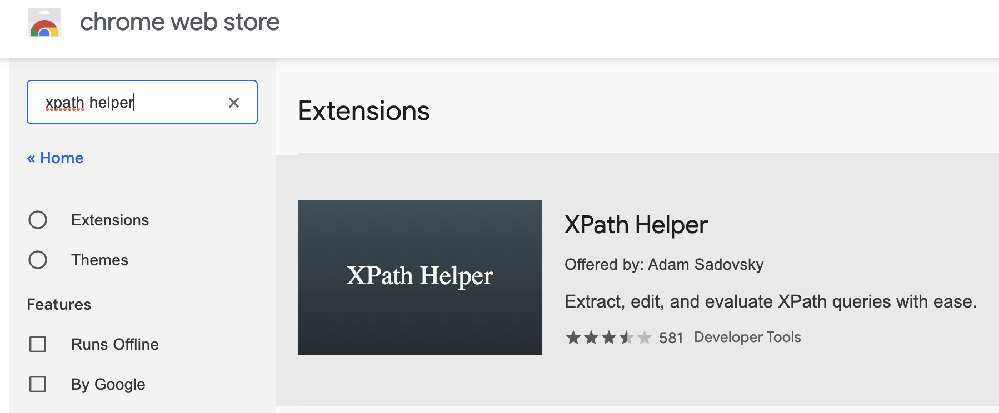

3. 確認要加入 XPath Helper。

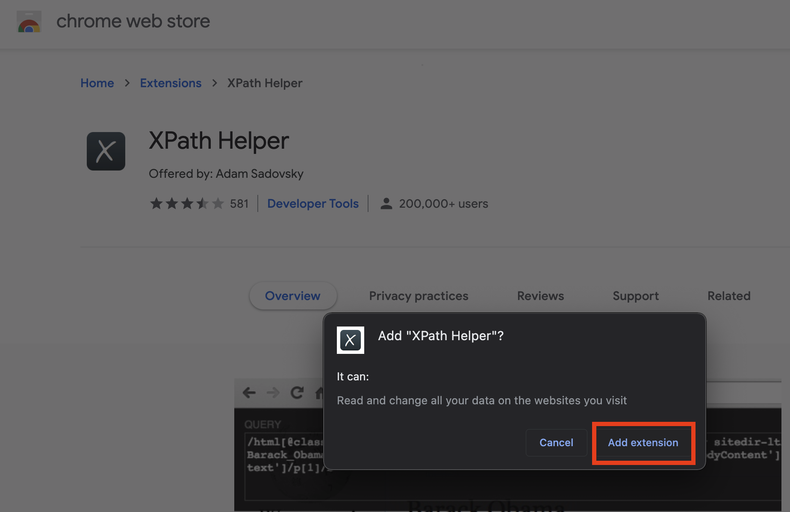

依照下列步驟定位 HTML 格式資料的 XPath。

1. 點選 XPath Helper 的外掛圖示。

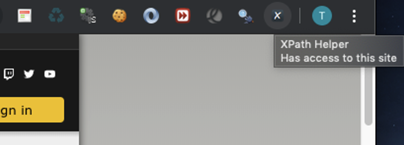

2. 留意 XPath Helper 介面左邊的 XPath 與右邊被定位到的資料。


3. 按住 shift 鍵移動滑鼠到想要定位的資料。

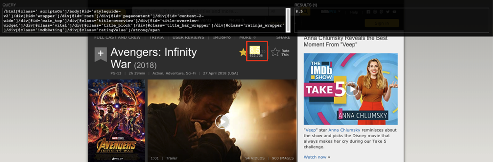

4. 試著縮減 XPath，從最前面的節點開始刪減，在最短的 XPath 依然能對應到資料即表示完成定位。


我們以 IMDB.com 的 Avengers: Infinity War (2018) 頁面示範如何以 XPath 定位評等。

利用 rvest 套件的 `read_html()` 函數將 HTML 資料格式讀入，獲得的資料結構同樣是命名為 xml_document 的 `list`，面對 xml_document 可以呼叫 rvest 套件提供的 `html_nodes()` 與 `html_text()` 函數指定 XPath 解析出文字格式的資料。

```{r}
# 安裝 jsonlite、rvest 與 magrittr
#pkgs <- c("jsonlite", "rvest", "magrittr")
#install.packages(pkgs)
# 載入 rvest, magrittr
library(rvest)
library(magrittr)

movie_url <- "https://www.imdb.com/title/tt4154756"
movie <- read_html(movie_url)
class(movie)
rating <- movie %>%
  html_nodes(xpath = "//strong/span") %>%
  html_text() %>%
  as.numeric()
rating
```

## 小結

在 Chapter \@ref(webScraping) 中我們簡介如何以 R 語言透過 jsonlite 、 xml2 與 rvest 等套件實踐網站爬蟲的核心任務：請求資料（requesting data）與解析資料（parsing data）。面對不同類型的網頁資料，分別以 jsonlite 套件的 `fromJSON()` 函數處理 Web API 的 JSON 格式資料；以 xml2 套件的 `read_xml()` 、 `xml_find_all()` 與 `xml_text()` 函數處理 Web API 的 XML 格式資料；以 rvest 套件的 `read_html()`、`html_nodes()` 與 `html_text()` 函數搭配 Chrome 瀏覽器外掛 Selector Gadget 以及 XPath Helper 處理 HTML 格式資料。

<!--chapter:end:17-web-scraping.Rmd-->

